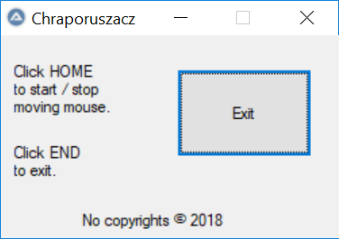

# Chraporuszacz

Projekt zawiera prostego bota służącego do ciągłego poruszania się kursora myszy w sposób całkowicie automatyczny wraz z przeznaczonym do tego GUI.

## Czym jest AutoIt?

Czy to kolejny “fantastyczny” język programowania? A może nieprzydatny wynalazek, przez który stracisz kilka godzin, a i tak się nigdy nie przyda? Odpowiedź brzmi: tak, ponieważ:
* AutoIt nie przyda Ci się w pracy - żadna firma z tego nie korzysta* i pewnie nie będzie korzystać,
* nie poznasz nowych znakomitych koncepcji technologicznych,
* nie zbudujesz z nim niczego innowacyjnego.

W zasadzie AutoIt ma jedno zastosowanie, dla którego warto go poznać: dobry fun. :)

*okej, niektóre korzystają. Ale jest to bardzo niszowe i rzadkie zastosowanie, wybierane głównie z braku pieniędzy.


AutoIt to język programowania. Bazuje na prostych skryptach, składniowo przypomina Visual Basic. Najważniejsze, co oferuje, to łatwe i szybkie tworzenie GUI (głównie okienek systemowych) oraz symulację urządzeń komputerowych (kierowanie pozycją i ruchami myszy, wprowadzanie tekstu, ustawianie hotkeysów wywołujących określone w kodzie akcje). W porównaniu do Pythona czy JS-a AutoIt oferuje nieporównywalnie mniej, jednak to **w AutoIt stworzysz w znacznie krótszym czasie coś, co dla początkującego programisty może być wspaniałym rozpoczęciem nowego rozdziału w życiu: bota!**

## Proste boty
Samo się rusza. Samo się klika. Samo znajduje, samo przełącza, samo lajkuje. SAMO ZARABIA (kto wie?). Z AutoItem może nie da rady napisać skutecznego bota do WoW-a czy CS-a, ale przy pomocy pewnych bibliotek można go fajnie zgrać np. z przeglądarką. 

Napiszemy bardzo prosty program pozwalający zrozumieć podstawowe zasady AutoIta ("Pierwsze boty za płoty”).

# Piszemy bota w AutoIt
## Task overview
Naszym prostym programem będzie coś, co może **przydać Ci się w pracy**, jeśli tylko chcesz się zdrzemnąć, ale musisz być dostępny, co ma zapewnić wykonywanie jakichś akcji, jak np. ruszanie myszką. Nasz program będzie po prostu ruszał myszką przy pomocy hotkeysów i GUI. 



Program nazwiemy Chraporuszacz ze względów - mam nadzieję - jasnych.

## Ok, to od czego zaczynamy?
Pobierzemy niezbędny soft, który pokrótce omówię, następnie spiszemy założenia, na których się oprzemy, a potem przejdziemy do kodu. Skrypty do AutoIt najlepiej pisze się w SciTe - lekkim edytorze kodu, którego wersja pobrana ze strony autorów AutoIt przystosowana jest tylko do tego języka (tak naprawdę SciTe obsługuje też inne języki, ale w praktyce nie nadaje się do niczego innego niż AutoIt).

* Wchodzimy tutaj: https://www.autoitscript.com/site/autoit/downloads/
* Pobieramy pierwszą wersję z góry - zawiera ona wszystko, czego potrzebujemy.
* Instalujemy.
* Odpalamy SciTe Script Editor. 

Pliki AutoIt, które umie otwierać SciTe, mają rozszerzenie .au3. Bieżącą pracę zapisuj w tym właśnie formacie.
Z ważnych dla SciTe opcji, jest w zasadzie tylko dwie:
 
* `Go` - kompiluje kod i uruchamia program (warto znać skrót: F5),
* `Build` - kompiluje kod i tworzy plik `.exe` (tak, AutoIt potrafi zapisać program w formacie `.exe`. Zrobimy to na koniec, na razie zadowolimy się `.au3`).

## Założenia
Program będzie miał formę małego okienka, którego można obsługiwać zarówno myszką, jak i klawiaturą. W tym celu stworzymy przyciski i zaprogramujemy hotkeysy.
* Po naciśnięciu `HOME`, program zacznie ruszać myszką: 50px w dół i prawo, a następnie 50px w górę i w lewo, i tak cały czas.
* Po wywołaniu `STOP` (również przyciskiem `HOME`) myszka się zatrzyma.
* Po naciśnięciu `HOME`, myszką się zatrzyma.
* Po naciśnięciu `END` lub kliknięciu przycisku `EXIT`, program wyłączy się.
* Dodamy jakiś tekst w stylu `Copyrights by…`.
* Program będzie działał **w nieskończonej pętli**, która będzie podtrzymywać jego działanie. Tak działa AutoIt - bez tego program po prostu wykona instrukcje i się zamknie.

## Do dzieła!
Pracę rozpoczniemy od napisania podstawowej funkcji ruszania myszką. Dopiero potem utworzymy okienko dla użytkownika.

Tworzymy zmienną odpowiedzialną za stan. Stan będzie zero-jedynkowy: rusza się albo się nie rusza (działa/nie działa). Domyślnie ustawimy stan na “nie rusza się”.
```
;zmienna odpowiedzialna za stan
Global $moving = False
```

Nietrudno się domyślić, jak to działa:
* Średnik rozpoczyna komentarz,
* `Global` - definiuje poziom zmiennej (podobnie jak `Local`),
* zmienne zawsze zaczynamy od znaku `$` (zarówno przy deklaracji, jak i przy używaniu),
* `False` / `True` - piszemy wielką literą.

Poniższa funkcja będzie odpowiedzialna za zmianę stanu:
```
Func changeState()
    $moving = Not $moving
    ConsoleWrite("Moving: " & $moving & @CRLF)
EndFunc
```

* Funkcje piszemy w blokach `Func ... EndFunc`,
* `ConsoleWrite` wyświetli odpowiedni tekst w konsoli (niewidoczne na użytkownika, tylko dla developera),
* `@CRLF` to nowa linia (odpowiednik popularniejszego `\n`).

Następnie umożliwimy łatwe wywołanie funkcji changeState za pomocą klawisza `HOME`:
```
;ustawienie hotkeysów
HotKeySet("{HOME}", "changeState")
```

Czyli: kliknij `HOME`, a wywoła się `changeState`. Od tej chwili nie będę umieszczał komentarzy w kodzie - kod jest self-explanatory. 

Napiszmy funkcję odpowiedzialną za ruch myszki. Będziemy ją wywoływać w nieskończonej pętli, o której wspominałem w założeniach. Przypominam: nieskończona pętla (czyli kod, który powtarza się w kółko dopóki się go nie przerwie) jest niezbędna, ponieważ w przeciwnym wypadku program się włączy, wykona i wyłączy.
```
Func letsMove()
    If $moving Then
        MouseMove(MouseGetPos(0)+50,                    
        MouseGetPos(1)+50)
        Sleep(500)  
        MouseMove(MouseGetPos(0)-50, 
        MouseGetPos(1)-50)
        Sleep(500)
    EndIf
EndFunc
```

Objaśnienie:
* Instrukcje warunkowe: `If … Then … End If`,
* Ruch myszki do pozycji `(x, y)`: `MouseMove(x, y)`,
* Pozycja myszki: `MouseGetPos(0)` dla pozycji `x` i `MouseGetPos(1)` dla pozycji `y`,
* `Sleep(x)` pauzuje program na x milisekund (czyli u nas - pół sekundy).

Przechodzimy do wspomnianej pętli. Umieścimy ją w funkcji, którą wywołamy na starcie:
```
Func letsRun()
    While 1
        letsMove()
    WEnd
EndFunc
```

Ta specyficzna forma `While 1` stanowi niezłamywalny warunek przerwania pętli (to takie `while 1==1`, bądź `while True`). 

Przerywanie pętli na razie rozwiążemy w prosty sposób: utworzymy prostą funkcję zamykającą cały program i hotkeysa, który ją wywoła. Zamknięcie całego programu to droga trochę na skróty - w końcu mieliśmy zakończyć tylko pętlę.

```
Func finish()
    Exit
EndFunc
```
oraz
```
HotKeySet("{END}", "finish")
```

Zapisz pracę. Nie odpalisz programu niezapisanego do pliku. Ale zanim odpalimy, zwróć proszę uwagę na porządek w kodzie. Na górze umieść zmienne, pod nimi deklaracje hotkeysów, a poniżej funkcje. Trzymaj się tego, a gdy dojdzie więcej funkcji, staraj się je segregować w porządku logicznym (np. funkcje odpalane na początku powinny być pierwsze etc.). Pamiętaj o wcięciach. 

No to odpalamy: `F5`. Kliknij `HOME` i zobacz co się stanie. Obserwuj konsolę. Kliknij `END`, by zakończyć. Wiedz, że zawsze można zakończyć działanie odpalonego programu klikając `Tools` -> `Stop Executing`. Właśnie napisałeś swojego pierwszego bota! Teraz tylko trzeba go zrobić używalnym.

## GUI - Graphical User Interface
Jakieś okienko jest konieczne. W celu stworzenia okienka zmodyfikujemy funkcję `letsRun()`:
```
Func letsRun()
    Local $ourGUI = GUICreate("Chraporuszacz", 250, 150)
    GUISetState(@SW_SHOW, $ourGUI)

    While 1
         letsMove()
    WEnd
EndFunc
```

W funkcji, która tworzy obiekt okienka - `GUICreate` - podaliśmy tytuł okienka i jego rozmiar. Następnie funkcją `GUISetState` sprawiliśmy, że to konkretne okienko się pojawi. Dopiszmy teraz wspominany warunek, który przerwie nam pętlę, gdy zamkniemy okienko:
```
Func letsRun()
    Local $ourGUI = GUICreate("Chraporuszacz", 250, 150)
    GUISetState(@SW_SHOW, $ourGUI)
    
    While 1
        letsMove()
        Switch GUIGetMsg()
            Case $GUI_EVENT_CLOSE
            ExitLoop
        EndSwitch
    WEnd
EndFunc
```

I tu bardzo ważna uwaga: `$GUI_EVENT_CLOSE` jest stałą, która nie zadziała, jeśli nie zostanie wcześniej zaimportowana pewna AutoItowa biblioteka: `GUIConstantsEx`. Na samym początku kodu dopisujemy więc:
```
#include GUIConstantsEx.au3
```

`Switch` jest wykonywany w każdej iteracji pętli, a więc na bieżąco sprawdzamy, co kryje się w `GUIGetMsg()`. Funkcja ta odpytuje GUI, czy coś się wydarzyło. Jeśli wystąpiło zdarzenie `$GUI_EVENT_CLOSE`, czyli zamknięcie okienka, wychodzimy z pętli, a jak wiemy wyjście z pętli zakończy działanie programu. Wrócę jeszcze raz do kończenia wykonywania programu: zauważ, że zrobiliśmy to na razie na dwa różne sposoby:
* Za pierwszym razem w funkcji `finish()` umieściliśmy słowo klucz `Exit`, które definitywnie kończy program,
* W samej pętli zaś umieściliśmy warunek, który przerywa samą pętlę, której przerwanie powoduje zakończenie programu.

Następnie do naszego GUI dodamy przycisk `Exit`:
```
Local $exitButton = GUICtrlCreateButton("Exit", 130, 25, 100, 65)
```

Zauważ, że w kodzie nigdzie nie napisaliśmy, na jakim GUI przycisk ma się pokazać. AutoIt wybiera po prostu ostatni utworzony GUI i na nim umieszcza obiekt. Warto o tym pamiętać, gdy tworzy się kilka okienek. Żeby jednak przycisk działał, rozszerz “kejsa” w `Switchu` o przycisk `Exit`, czyli zdarzenie odpowiadające za jakie kliknięcie:
```
case $GUI_EVENT_CLOSE, $exitButton
```

Dorzućmy jeszcze krótką instrukcję obsługi. Umieść ją pomiędzy utworzeniem obiektu GUI a wskazaniem jego stanu:
```
Local $homeLabel = GUICtrlCreateLabel("Click HOME" & @CRLF & "to start / stop" & @CRLF & "moving mouse.", 10, 20)
Local $endLabel = GUICtrlCreateLabel("Click END" & @CRLF & "to exit.", 10, 80)
Local $creditsLabel = GUICtrlCreateLabel("No copyrights " & Chr(169) & " 2018", 60, 130)
```

No i gotowe:  Teraz pozostaje tylko utworzyć plik `.exe`. Klikamy `Tools` -> `Build`, a w miejscu, gdzie trzymamy plik `.au3` powinien pojawić się nowy `.exe`. Od tej chwili program jest samodzielny i nie potrzebuje edytora SciTe, a Ty właśnie utworzyłeś swojego pierwszego bota w AutoIt.

## Podsumowanie
Mam nadzieję, że złapałeś chociaż trochę zajawkę na AutoIta! Choć jego możliwości są mocno ograniczone, to nadrabia prostotą użytkowania. AutoIt ma sporo rozszerzeń i nawet jakąś tam społeczność. Można go spiąć z przeglądarką i zautomatyzować pewne procesy, które normalnie robilibyśmy sami.
